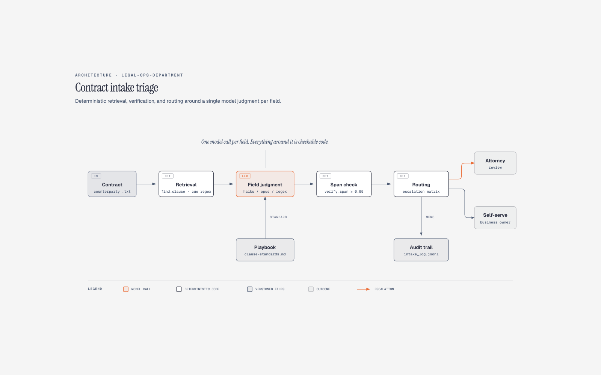
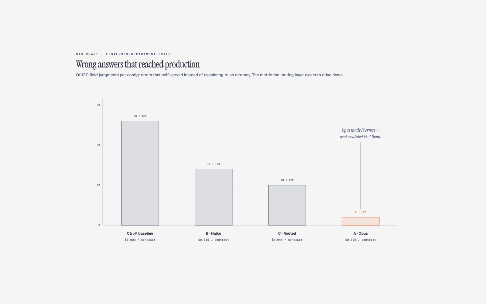

# legal-ops-department

A working model of a legal operations department built around Claude:
third-party-paper contract intake triage, with a measured eval against a
public labeled corpus, a keyword baseline, and a cost model from logged
token usage. One workflow, done end to end — not a chatbot over PDFs.

## 1. The problem, in business language

A 42-page MSA lands in a shared inbox. Two days later a paralegal Ctrl-Fs
for "assign," "compete," "liability," skims the hits, and fills in
`Intake Memo v4 FINAL (updated).docx` from the shared drive. Scary findings
get forwarded with "can you look at section 11." Nothing is logged. Three
paralegals do it three different ways, and the newest one doesn't know that
governing law outside Delaware, New York, or California is an automatic
escalation, because that rule lives in a senior paralegal's head.

This repo is that department, rebuilt so the rules live in versioned files,
the tools are checkable code, every review ends in a logged decision — and
the model is trusted for exactly one thing.

> **The short version:** the manual process is quietly wrong on 26 of 120
> checks and leaves no record. The rebuilt pipeline gets that down to 2, at
> about a dime per contract, with every finding quote-verified against the
> contract text and every review logged. What it does *not* yet prove:
> hours saved (never measured) and the promise that clean contracts skip
> the attorney (never exercised on this corpus). Receipts in §4; the full
> list of what this can't do in §5.

## 2. Approach — and what I chose not to do

The workflow is **third-party paper contract intake**: ten fields, one memo,
one decision — attorney review or business self-serve. I picked it because
it recurs, it ends in a decision rather than a chat transcript, and it maps
1:1 onto [CUAD](https://www.atticusprojectai.org/cuad)'s label schema, so
the eval numbers are measured against real ground truth instead of
self-graded.

Decisions that shaped the build:

- **The model makes one call per field, sandwiched between deterministic
  layers.** Retrieval is cue-pattern regex (`find_clause`), verification is
  string matching (`verify_span`), routing is a five-rule matrix
  ([`playbook/escalation-matrix.md`](playbook/escalation-matrix.md), executable
  form in [`evals/routing.py`](evals/routing.py)). The model is only trusted
  for the judgment in between, and its quote is checked against the document
  before it can appear in a memo.
- **The gold set — the answer key the pipeline is graded against — froze
  before any model ran.** 12 contracts, 120 judgments,
  selected by a deterministic rule committed in
  [`data/gold/build_gold_set.py`](data/gold/build_gold_set.py), spot-checked,
  then never touched. Prompts froze before the first run and were not tuned
  against the gold set.
- **The framing was pre-registered.** The "either outcome is a win"
  paragraph and the Limitations section were committed before the eval runs
  (see the git history) so they can't be read as post-hoc.
- **Not built, on purpose:** redlining, a web UI (Claude Code plus the MCP
  server is the interface), CLM/e-signature ingestion, RAG over a clause
  library (the workflow is single-document; deterministic retrieval is
  better here), fine-tuning, multi-agent orchestration (theater at this
  scope), non-US law.

## 3. What's built



The repo is the department's shared drive:

| Piece | What it is |
|---|---|
| [`playbook/`](playbook/) | The rules that used to live in someone's head: clause standards, the escalation matrix, the governing-law allowlist. The playbook wins over model judgment — stated in [`CLAUDE.md`](CLAUDE.md) and enforced in the skills. |
| [`mcp/contract_lake/`](mcp/contract_lake/) | Six-tool MCP server. Closed enums carry the domain knowledge; none of the six tools calls a model. [`tools.py`](mcp/contract_lake/tools.py) is imported directly by the evals, so evals exercise the identical code path. |
| [`.claude/skills/`](.claude/skills/) | Four skills: intake triage (the main workflow), playbook lookup, memo formatting (deliberately dumb), escalation routing (deliberately deterministic). |
| [`roles/`](roles/) | Three roles with different permissions: paralegal (runs intake), contracts attorney (owns the playbook and rejections), vendor manager (read-only). |
| [`evals/`](evals/) | 120 frozen scenarios, three configs, keyword baseline, scoring with grounding enforced. |
| [`data/`](data/) | CUAD provenance, the frozen gold set, and the append-only intake log the old process lacked. |

## 4. Evaluation

Full tables: [`evals/results/results.md`](evals/results/results.md).
Scoring enforces grounding: a "present" whose quote fails span verification
counts as a false positive even when the flag was right.

| Config | Silent errors | Caught errors | F1 | Precision | Recall | Halluc. spans | % escalated | Cost / contract |
|---|---|---|---|---|---|---|---|---|
| Ctrl-F baseline ($0.00) | **26** | 0 | 0.776 | 0.714 | 0.849 | n/a | 0% | $0.000 |
| B — Haiku everywhere | 14 | 7 | 0.784 | 0.864 | 0.717 | 4 | 32% | $0.015 |
| C — routed (pre-registered ship) | 10 | 13 | 0.747 | 0.895 | 0.642 | 6 | 58% | $0.044 |
| A — Opus everywhere | **2** | 14 | **0.837** | 0.911 | 0.774 | 0 | 90% | $0.095 |

Reading the table: a **silent error** is a wrong field judgment that
reached the memo with no flag — counted over 120 field judgments (ten
questions on each of 12 contracts, not 120 contracts). A **caught error**
was also wrong, but the escalation rules routed it to an attorney before
anyone relied on it. Precision: how often a "present" flag is right.
Recall: how many truly present clauses get flagged. F1 blends the two;
1.000 is perfect.



**The pre-registered framing** (committed before the runs): either Haiku
matches Opus on the standard fields and the routing rule is validated, or
the escalation rule catches the gap before a human sees a wrong answer.
What actually happened is more interesting:

- **The headline number is silent errors, not F1.** Keyword search is
  embarrassingly competitive on raw F1 (0.776 vs Haiku's 0.784) — but it is
  wrong quietly on 26 of 120 field judgments, with no audit trail. The
  pipeline's job is to never be wrong quietly: silent errors fall
  26 → 14 → 10 → 2 across the configs. Opus made 16 errors and escalated
  14 of them. The price is printed in the same row: Opus escalates 90% of
  field judgments to get there. Any pipeline can reach zero silent errors
  by escalating everything — that's why % escalated sits beside the error
  counts. What this posture buys is *nothing wrong reaches a human
  silently*, not *fewer things reach a human*.
- **The self-serve path never fired — the triage half is unproven.** Every
  one of the 12 contracts, in every config, routed `attorney_review`. The
  corpus was deliberately selected so each field appears both present and
  absent across it, so at least one field always escalated. The eval
  therefore validates the escalation layer and the memo quality; it does
  not validate the promise that clean contracts skip the attorney. Testing
  that requires a corpus with genuinely clean paper — this one didn't
  contain a single self-serve case to catch.
- **The "ship the regex for governing law" hypothesis failed.** The plan
  predicted regex jurisdiction extraction would match the model. Measured:
  regex 0.778, model 1.000. The deterministic *allowlist check* stays —
  it's a file and a string comparison — but extraction should use the
  model. One falsified pre-registration is reported as exactly that — and
  the operating rules in [`CLAUDE.md`](CLAUDE.md) were updated after
  measurement to match, with the edit labeled there, because shipping
  instructions that contradict your own eval is worse than an honest
  post-run change.
- **Haiku's self-reported confidence is uninformative.** It said "high" on
  118 of 120 judgments (accuracy at "high": 0.831). Opus is calibrated
  (0.914 at high vs 0.692 at low). This validates leaning the routing on
  the two deterministic signals and publishing the calibration table
  rather than trusting self-report.
- **One run per config, small n per field.** B and C make identical Haiku
  calls on the standard fields yet score 0.75 vs 0.58 on anti-assignment —
  pure sampling noise at 12 examples per field. Treat third decimals as
  texture; the gaps the conclusions rest on (26 → 2 silent errors, the
  calibration split) are far larger than the noise.
- **`uncapped_liability` is hard for everyone** (0.58–0.67 in every config,
  baseline included) — CUAD marks it present via carve-outs from the
  liability cap, which hides in language the cue patterns and the models
  both under-catch. That's the field a real department would write more
  playbook for first.

**Cost** ([`costs/cost_model.md`](costs/cost_model.md), from logged usage,
not estimates): the model cost is noise. The gap between Opus-everywhere
and the routed config is about **$122/year** at a hypothetical 200
contracts/month — roughly two hours of a paralegal's loaded time. You'd
need ~1,200 contracts/month before the monthly gap equals one paralegal
hour. So routing is not a cost play at this volume, and the measured
numbers say Opus-everywhere wins the accuracy-and-routing play it was
supposed to be: fewest silent errors by a factor of five. *(Volume is the
scaling input, not a finding — per-contract cost is what was measured.)*

## 5. Limitations — when I would NOT use this

- **CUAD's label definitions are not this department's.** Where they
  diverge from everyday usage (exclusivity is the documented case — see
  [`data/README.md`](data/README.md)), the playbook adopts CUAD's definition
  and says so, because silently relabeling gold data is worse.
- **120 judgments is small.** Rare clause types rest on a handful of
  examples; per-field numbers are directional, not precise.
- **CUAD contracts are public-company SEC filings** — better drafted than
  the mid-market vendor NDAs real legal ops sees. Real-world recall is
  likely lower than measured.
- **No measured manual-time baseline.** The quality comparison (silent
  errors, F1 vs the Ctrl-F baseline) is measured; the time saved per
  contract is not. Any hours-saved claim would be an estimate, so none is
  made here.
- **Would not use for:** final decisions on high-stakes clauses (the memo
  is a recommendation to an attorney by design), non-US law, adversarial
  counterparties, or as a system of record.
- **No confidentiality, privilege, or data-handling analysis.** This build
  processes public SEC filings, so nothing sensitive leaves the machine —
  but a real deployment sends third-party contracts, some under NDA, to an
  outside API. Data-handling, privilege, and vendor-security review are
  prerequisites to processing real paper; none of that work is done here.
- **The eval measures a leaner pipeline than the skills prescribe.** The
  intake skill mandates a paged confirmation read before recording a
  high-stakes field as absent; `run_eval.py` skips that pass, so measured
  recall is a floor for the documented workflow. Recall in every config is
  also capped by the same cue patterns the baseline uses — which is why no
  model config out-recalls Ctrl-F.
- **The governing-law regex lost** to the model on extraction accuracy
  (0.778 vs 1.000). It stays in the repo as the measured comparison, not
  as the shipped path — and the allowlist rule it feeds remains
  deterministic either way.
- **The JSONL intake log is not a compliance-grade record.** Append-only
  file, not an immutable audit system.

## 6. Reproduce it

```bash
git clone https://github.com/briansaug/legal-ops-department
cd legal-ops-department
uv venv --python 3.12 .venv && uv pip install --python .venv/bin/python -r mcp/contract_lake/requirements.txt
./data/fetch_cuad.sh                              # downloads CUAD (~106 MB), stages the 12 frozen contracts
cp .env.example .env                              # add your ANTHROPIC_API_KEY
.venv/bin/python evals/baseline_keyword.py        # free, instant
.venv/bin/python evals/run_eval.py --config C     # ~$0.55 total
.venv/bin/python evals/score.py                   # writes evals/results/results.md
```

For the interactive department, open the repo in Claude Code: `.mcp.json`
registers the contract-lake server, the skills load from
`.claude/skills/`, and `roles/paralegal/CLAUDE.md` is the seat to sit in.
Run one contract end to end with
`.venv/bin/python evals/run_eval.py --config C --demo aurasystemsinc` —
it records a real memo to `data/intake_log.jsonl`.

## 7. Outcome and handoff

Built and measured in one day against a frozen gold set: a triage pipeline
whose silent-error count drops from 26 (the Ctrl-F status quo) to 2, with
every judgment span-verified, every review logged, and the escalation rules
in files an attorney can edit. The eval falsified one of my own design
choices (the governing-law regex) and surfaced one honest surprise (the
cheap model's confidence signal is useless); both are reported above rather
than papered over.

What someone else needs to run it: an Anthropic API key and §6. The gold
set, prompts, and scoring are frozen and committed, so a re-run is
comparable to the numbers above.

---

*Corpus: CUAD v1 (CC BY 4.0, The Atticus Project) — see
[`data/README.md`](data/README.md) for attribution and the EDGAR caveat.
Diagrams built with
[diagram-design](https://github.com/cathrynlavery/diagram-design).*
